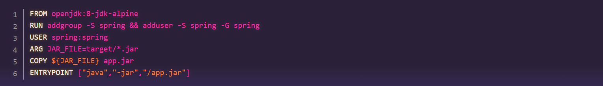
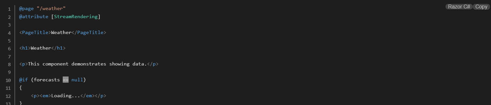

# Brism - Syntax Highlighting Made Easy for Blazor

[](https://www.nuget.org/packages/Brism)
[](https://opensource.org/licenses/MIT)




Brism brings the power of PrismJS to Blazor, making your code examples look fantastic with minimal effort. Perfect for documentation, blogs, or any application that needs beautiful code snippets.

## Features

- Syntax highlighting that actually looks good
- Line numbers (that you can toggle on/off)
- Cool command-line styling for terminal examples
- Works seamlessly with Blazor Server and WebAssembly
- Pick from various themes to match your site
- Super easy to set up (seriously, it takes like 2 minutes)
- Type-safe language selection (no more typos!)

## Getting Started

### 1. Install the NuGet Package

```bash
dotnet add package Brism
```

### 2. Add Required Files

In your `App.razor` file (or `_Host.cshtml` for Server-side Blazor), add these lines in the `<head>` section:

```html
<!-- Base PrismJS styles (required) -->
<link href="_content/Brism/prism.css" rel="stylesheet" />

<!-- Choose ONE theme from below (we're using synthwave84 as an example) -->
<link href="_content/Brism/prism-synthwave84.css" rel="stylesheet" />
```

And these scripts at the end of the `<body>`:

```html
<script src="_content/Brism/prism.js"></script>

<script type="module" src="_content/Brism/prismInterop.js"></script>
```

### 3. Wire It Up

Add this to your `Program.cs`:

```csharp
builder.Services.AddBrism();
```

### 4. Import It

Add this to your `_Imports.razor`:

```csharp
@using Brism
```

### 5. Use It!

Drop this into any of your Blazor pages:

```razor
<CodeBlock
    Code="@myCode"
    Language="CodeLanguage.CSharp"
    EnableLineNumbers="true" />
```

## Available Themes

### Dark Themes

- **Modern & Sleek**
  - `prism-one-dark.css` - Atom's One Dark
  - `prism-material-dark.css` - Material Design inspired
  - `prism-vsc-dark-plus.css` - VS Code dark theme
  - `prism-dracula.css` - Famous Dracula theme
  - `prism-synthwave84.css` - Retro synthwave vibes

- **Rich & Deep**
  - `prism-night-owl.css` - Perfect for night coding
  - `prism-nord.css` - Cool Nordic theme
  - `prism-material-oceanic.css` - Deep blue oceanic
  - `prism-darcula.css` - IntelliJ-inspired
  - `prism-shades-of-purple.css` - Vibrant purple theme

- **Nature-Inspired**
  - `prism-duotone-dark.css` - Subtle two-tone dark
  - `prism-duotone-forest.css` - Forest-inspired colors
  - `prism-duotone-earth.css` - Earthy tones
  - `prism-duotone-sea.css` - Ocean-inspired theme
  - `prism-duotone-space.css` - Space-like dark theme

### Light Themes

- **Clean & Professional**
  - `prism-one-light.css` - Atom's One Light theme
  - `prism-material-light.css` - Material Design light
  - `prism-vs.css` - Visual Studio inspired

- **Soft & Gentle**
  - `prism-duotone-light.css` - Gentle two-tone light
  - `prism-gruvbox-light.css` - Soft retro colors
  - `prism-coldark-cold.css` - Cool light tones

### Special Themes

- **Unique Styles**
  - `prism-lucario.css` - Pokémon-inspired
  - `prism-hopscotch.css` - Playful and colorful
  - `prism-holi-theme.css` - Festive and bright
  - `prism-laserwave.css` - Retro laser theme
  - `prism-z-touch.css` - Modern touch

### High Contrast

- `prism-a11y-dark.css` - Accessibility-focused dark theme
- `prism-cb.css` - Color-blind friendly
- `prism-ghcolors.css` - GitHub-like colors

## Making It Your Own

Here's what you can tweak:

| Property | What it does | Default |
|----------|-------------|---------|
| Code | Your code snippet (required) | - |
| Language | The language for highlighting (required) | - |
| EnableLineNumbers | Show/hide line numbers | true |
| EnableCommandLine | Add a command prompt look | false |
| CommandLineUser | Custom prompt user | "User" |
| CommandLineHost | Custom prompt host | "Host" |
| Css | Extra CSS if you need it | "" |

## Languages? We've Got Them All!

No more guessing language names or dealing with typos! We provide a handy `CodeLanguage` enum with constants for all supported languages. Here are some popular ones:

```csharp
// Common languages
CodeLanguage.CSharp      // for C#
CodeLanguage.JavaScript  // for JavaScript
CodeLanguage.TypeScript  // for TypeScript
CodeLanguage.Python      // for Python
CodeLanguage.Html        // for HTML
CodeLanguage.Css         // for CSS
CodeLanguage.Json        // for JSON
CodeLanguage.Sql         // for SQL
CodeLanguage.Docker      // for Dockerfiles
CodeLanguage.Yaml        // for YAML/YML
CodeLanguage.Markdown    // for Markdown
CodeLanguage.Bash        // for Shell scripts
```

And that's just the tip of the iceberg! We support 180+ languages, including:

- All major web technologies
- Popular programming languages
- Markup and styling languages
- Configuration formats
- Domain-specific languages
- And tons more!

Just use the `CodeLanguage` enum to ensure you're always using the correct language identifier.

## Cool Things You Can Do

### Command Line Style

Perfect for showing terminal commands:

```razor
<CodeBlock
    Code="npm install something-cool"
    Language="CodeLanguage.Bash"
    EnableCommandLine="true"
    CommandLineUser="dev"
    CommandLineHost="laptop" />
```

### Clean Code View

When you just want the code without the extras:

```razor
<CodeBlock
    Code="@myCleanCode"
    Language="CodeLanguage.CSharp"
    EnableLineNumbers="false" />
```

### Multiple Languages in One Page

Mix and match different languages:

```razor
<CodeBlock Code="@htmlCode" Language="CodeLanguage.Html" />
<CodeBlock Code="@cssCode" Language="CodeLanguage.Css" />
<CodeBlock Code="@jsCode" Language="CodeLanguage.JavaScript" />
```

## Want to Help?

We'd love to have you on board! Here's how you can contribute:

1. Fork it
2. Create your feature branch (`git checkout -b feature/cool-new-thing`)
3. Make your changes
4. Push to the branch (`git push origin feature/cool-new-thing`)
5. Open a Pull Request

Even small improvements are welcome - found a typo? Fixed a bug? We appreciate all contributions!

## The Legal Stuff

This project is under the MIT License - basically, you can do whatever you want with it, just keep the license notice. See the [LICENSE](LICENSE) file for the formal details.

## Show Some Love 

If Brism makes your life easier:

- Give us a star on GitHub
- Tell your fellow devs about it
- Found a bug? Open an issue
- Have an idea? Let's hear it!

## Thank You!

Big thanks to:

- The amazing [PrismJS](https://prismjs.com/) team
- Everyone who has contributed
- You, for checking out our project!

---
Built with passion for the Blazor community 